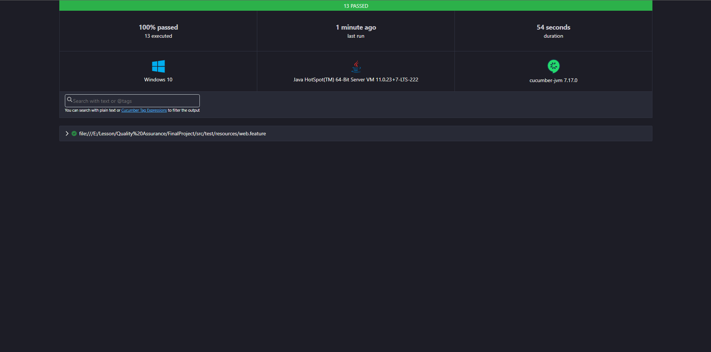

Final Project

- Pengujian otomatisasi API dan Web UI menggunakan Cucumber, Java, Gradle, Selenium, Rest Assured, serta konfigurasi GitHub Actions.
- Pengujian otomatisasi API dapat dijalankan dengan perintah berikut: "./gradlew cucumberApiTests"
- Pengujian otomatisasi Web UI dapat dijalankan dengan perintah berikut: "./gradlew cucumberWebTests"

- Untuk API test, menggunakan public API berikut:
    - https://dummyapi.io/docs/user (Get User by ID, Create User, Update User, Delete User)
    - https://dummyapi.io/docs/tag (Get List of Tags)
- Untuk Web UI Test menggunakan website berikut sebagai target dan pembuatan test scenario: https://www.demoblaze.com/

- Report pengujian otomatisasi API

- Report pengujian otomatisasi Web UI

